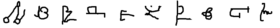
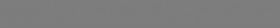

# Data Augmentation GAN in PyTorch

<i>Time-lapse of DAGAN generations on the omniglot dataset over the course of the training process.</i>

## Table of Contents
1. [Intro](#intro)
2. [Background](#background)
3. [Results](#results)
4. [Training your own DAGAN](#train)
5. [Technical Details](#details)
	1. [DAGAN Training Process](#dagan_train)
	2. [Classifier Training Process](#classifier_train)
	3. [Architectures](#architectures)
6. [Acknowledgements](#acknowledgements)

## 1. Intro 

This is a PyTorch implementation of Data Augmentation GAN (DAGAN), which was first proposed in [this paper](https://arxiv.org/abs/1711.04340) with a [corresponding TensorFlow implementation](https://github.com/AntreasAntoniou/DAGAN).

This repo uses the same generator and discriminator architecture of the original TF implementation, while also including a classifier script for the omniglot dataset to test out the quality of a trained DAGAN.

## 2. Background 

The motivation for this work is to train a [Generative Adversarial Network (GAN)](https://en.wikipedia.org/wiki/Generative_adversarial_network) which takes in an image of a given class (e.g. a specific letter in an alphabet) and outputs another image of the same class that is sufficiently different looking than the input. This GAN is then used as a tool for data augmentation when training an image classifier.

Standard data augmentation includes methods such as adding noise to, rotating, or cropping images, which increases variation in the training samples and improves the robustness of the trained classifier. Randomly passing some images through the DAGAN generator before using them in training serves a similar purpose.

## 3. Results 

To measure the quality of the DAGAN, classifiers were trained both with and without DAGAN augmentations to see if there was improvement in classifier accuracy with augmentations. The original paper showed improvement on the omniglot dataset using 5, 10, and 15 images per class to train the classifier. As expected, the fewer samples used, the more impactful the augmentations were.

This PyTorch implementation showed statistically significant improvment on the omniglot dataset with 1-4 samples per class but had negligible gains with 5+ samples per class. The below table shows the classifier accuracy with and without DAGAN augmentations as well as the statistical significance level that the augmentations are in fact better. (More details on confidence interval methodology [can be found here](#classifier_train)).

| Samples per Class                            | 1     | 2     | 3     | 4     | 5     |
|----------------------------------------------|-------|-------|-------|-------|-------|
| <b>Acc. w/o DAGAN</b>                               | 16.4% | 29.0% | 46.5% | 57.8% | 67.1% |
| <b>Acc. w/ DAGAN</b>                                | 19.2% | 39.4% | 52.0% | 65.3% | 69.5% |
| <b>Confidence level that augmentations are better | 97.6% | 99.9% | 97.4% | 97.8% | 60.7% |

## 4. Training your own DAGAN 

The easiest way to train your own DAGAN or augmented omniglot classifier is through Google Colab. The Colab notebooks used to produce the results shown here can be found below:
- [Train omniglot DAGAN](https://colab.research.google.com/drive/1U-twOEiguyIgiL6h9H6130tF-O_g-b-u)
- [Train omniglot classifier with DAGAN augmentations](https://colab.research.google.com/drive/1oJggcS6-3x_chbEfahSJCsy19kWBxWeE)

Running those notebooks as is should reproduce the results presented in this readme. One of the advantages of PyTorch relative to TensorFlow is the ease of modifying and testing out changes in the training process, particulary to the network architecture. To test out changes, you can fork this repo, make necessary changes, and re-run the colab script using the forked repo.

## 5. Technical Details 

### 5.1 DAGAN Training Process 
Recall the procedure for training a traditional GAN:
  - Create 2 networks, a generator (G) and a discriminator (D)
  - To train D
    - Randomly sample images from G and train D to recognize as fake
    - Randomly sample real images and train D to recognize as real`
  - To train G
    - Sample images from G and pass them through D
    - Train/modify G to increase likelihood D classifies given samples as real
  - Train G and D alternately
  - This iteratively makes D better at distinguishing real and fake, while making G better at producing realistic images

Training a DAGAN requires a slight twist:
  - To train D
    - Randomly sample pairs of real images (source, target), where both items in a pair belong to the same class
    - Pass both source, target to D to recognize as real
    - Pass source image to G to produce a realistic looking target
    - Pass source, generated target to D to recognize as fake
  - To train G
    - Sample real images (source) and pass them through G to produce generated targets
    - Train/modify G to increase likelihood D classifies (source, generated target) pairs as real
  - D learns to distinguish real and fake targets for a given source image
  - G learns to produce images that belong to the same class as source, while not being too similar to source (being too similar would provide a simple way for D to recognize fake targets)
  - Thus, G provides varied images that are somewhat similar to the source, which is our ultimate goal

The omniglot DAGAN was trained on all the examples in the first 1200 classes of the dataset. The generator was validated on the next 200 classes by visual inspection. Training was done for 50 epochs, which took 3.3 hours on a Tesla T4 GPU.

The network was trained using the Adam optimizer and the Improved Wasserstein loss function, which has some useful properties allowing signal to better pass from D to G during the training of G. More details can be found in the [Improved Wasserstein GAN paper](https://arxiv.org/abs/1704.00028).

### 5.2 Omniglot Classifier Training Process 

Omniglot classifiers were trained on classes #1420-1519 (100 classes) of the dataset for 200 epochs. Classifiers were trained with and without augmentations. When trained with augmentations, every other batch was passed through the DAGAN, so the total number of steps was the same in both configurations.

To estimate more robustly the accuracy in each configuration, 10 classifiers were trained, each on a slightly different dataset. More specifically, out of the 20 samples available for each class, a different subset of k images was chosen for each of the 10 classifiers. A two-sample t-test was then used to determine confidence level that the 2 distributions of accuracies were sufficiently different (i.e. statistical significance of accuracy improvement from augmentation).

This exercise was repeated using (1, 2, 3, 4, 5) samples per class. Training was done using Adam optimizer and standard cross-entropy loss.

### 5.3 Architectures 

The DAGAN architectures are described in detail in the paper and can also be seen in the PyTorch implementation of the [generator](https://github.com/amurthy1/dagan_torch/blob/master/generator.py) and [discriminator](https://github.com/amurthy1/dagan_torch/blob/master/discriminator.py).

In a nutshell, the generator is a UNet of dense convolutional blocks. Each block has 4 conv layers, while the UNet itself is 4 blocks deep on each side.

The discriminator is a DenseNet with 4 blocks, each containing 4 conv layers.

The omniglot classifier uses the [standard PyTorch DenseNet implementation](https://pytorch.org/hub/pytorch_vision_densenet/) with 4 blocks, each having 3 conv layers. The last layer of the classifier was concatenated with a 0/1 flag representing whether a given input was real or generated. This was followed by 2 dense layers before outputting the final classification probabilities. This was useful to allow the image features output from the last layer of the DenseNet to interact with the real/generated flag in order to produce more accurate predictions.

## 6. Acknowledgements 

- As mentioned earlier, this work was adopted from [this paper](https://arxiv.org/abs/1711.04340) and [this repo](https://github.com/AntreasAntoniou/DAGAN) by A. Antoniou et al.

- The omniglot dataset was originally sourced from [this github repo](https://github.com/brendenlake/omniglot/) by user [brendanlake](https://github.com/brendenlake).

- The PyTorch Wasserstein GAN (WGAN) implementation in this repo was closely adopted from [this repo](https://github.com/EmilienDupont/wgan-gp) by user [EmilienDupont](https://github.com/EmilienDupont/).

